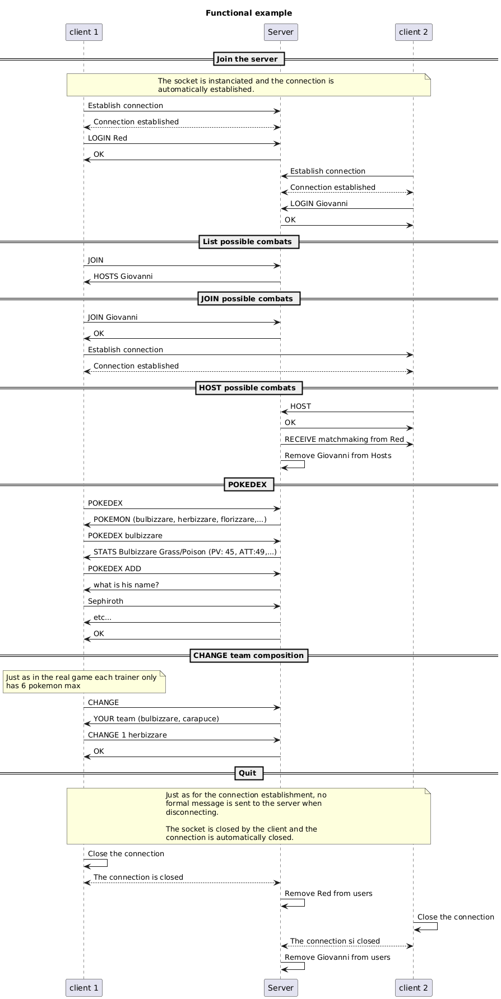
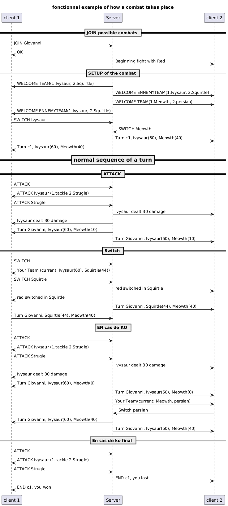

# Pokémon Octogone Edition

**Pokémon Octogone Edition** is a TCP-based multiplayer Pokémon game developed for the **DAI** course. The project leverages **Maven** as a build and dependency management tool, making it easy to manage dependencies and run the project.

---

## Table of Contents

- [Pokémon Octogone Edition](#pokémon-octogone-edition)
  - [Table of Contents](#table-of-contents)
  - [Introduction](#introduction)
  - [Features](#features)
  - [Requirements](#requirements)
  - [Installation](#installation)
  - [Usage](#usage)
    - [Run as Server](#run-as-server)
    - [Run as Client](#run-as-client)
    - [Docker](#docker)
      - [Server](#server)
      - [Client](#client)
  - [Project Structure](#project-structure)
  - [Contributing](#contributing)
    - [How to Contribute](#how-to-contribute)
  - [License](#license)

---

## Introduction

Pokémon Octogone Edition brings the classic Pokémon battles into a TCP-based environment. The game features a **client-server architecture** where players can connect, battle, and experience turn-based gameplay in real-time. 

This project serves as an educational example of implementing **distributed systems** with TCP sockets in Java.

---

## Features

- **TCP-based Multiplayer**: Players connect to a central server to engage in battles.
- **Client-Server Architecture**: Separation of client and server logic.
- **Cross-Platform Compatibility**: Written in Java, ensuring it runs on any platform with JVM support.
- **Dependency Management**: Powered by Maven for seamless build and dependency handling.

---

## Requirements

- **Java** 11 or higher
- **Maven** 3.6+ (optional for building, as Maven wrapper is included)
- Command-line access

---

## Installation

1. Clone the repository:
   ```bash
   git clone https://github.com/your-repo/pokemon-octogone-edition.git
   cd pokemon-octogone-edition
   ```

2. Build the project using Maven:
   ```bash
   ./mvnw clean package
   ```

   This will generate the runnable JAR file in the `target` directory.

---

## Usage

The game can be executed in either **server mode** or **client mode** using the generated JAR file.
Here you can find a schema explaining which command you can use before a fight:
    -**JOIN "serveruserid"** to challeng someone that is waiting to fight, or get the list of people waiting to fight if no id is entered
    -**HOST** to wait for someone to challenge you
    -**POKEDEX "pokemon"** to see all the pokemon, or a specific pokemon
    -**POKEDEX ADD** to add a specific pokemon to the database
    -**CHANGE "number" "pokemon"** to swap the place of the pokemon in your team with the number with the pokemon that you want
    -**QUIT** to quit the communication



Here you can find a schema explaining which command you can use mid-fight:
    -**ATTACK "move"** so that the active pokemon use the move on the ennemy
    -**Switch "pokemon"** to switched in the pokemon that you want

### Run as Server

For now you can simply run the jar with the 'client' or 'server' argument.

Start the server by executing:
```bash
java -jar target/pkmOctogoneEdition.jar -server
```

The server will listen for incoming client connections.

### Run as Client

Connect to the server by executing:
```bash
java -jar target/pkmOctogoneEdition.jar -client
```

### Docker
You can run the program with the commands :
#### Server
```bash
docker compose up pokemon-server                                                      
```
#### Client
```bash
docker compose up pokemon-client                                                       
```


---

## Project Structure

```
pokemon-octogone-edition/
├── src/
│   ├── main/
│   │   ├── java/               # Source code
│   │   └── resources/          # Game assets and configuration
│   └── test/                   # Unit tests
├── target/                     # Compiled JAR file (after build)
├── .mvn/                       # Maven wrapper files
├── pom.xml                     # Maven project file
└── README.md                   # Project documentation
```

---

## Contributing

We welcome contributions! Feel free to submit a pull request or open an issue for bugs and feature requests.

### How to Contribute

1. Fork the repository.
2. Create a new branch:
   ```bash
   git checkout -b feature/your-feature-name
   ```
3. Make your changes and commit:
   ```bash
   git commit -m "Add your message here"
   ```
4. Push to your branch:
   ```bash
   git push origin feature/your-feature-name
   ```
5. Submit a pull request.

---

## License

This project is licensed under the MIT License. See the `LICENSE` file for more details.
