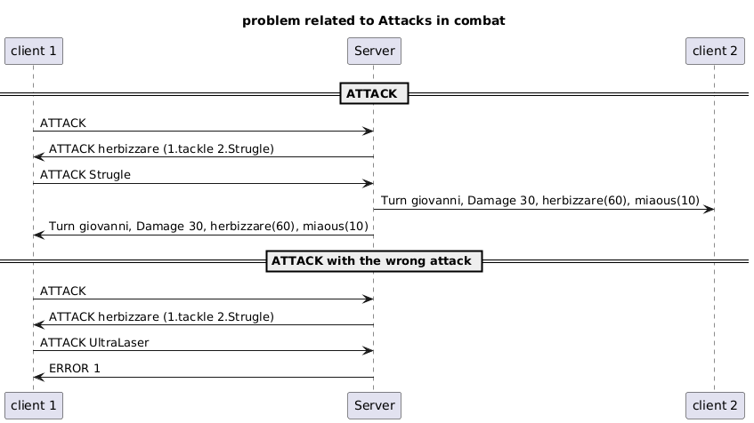
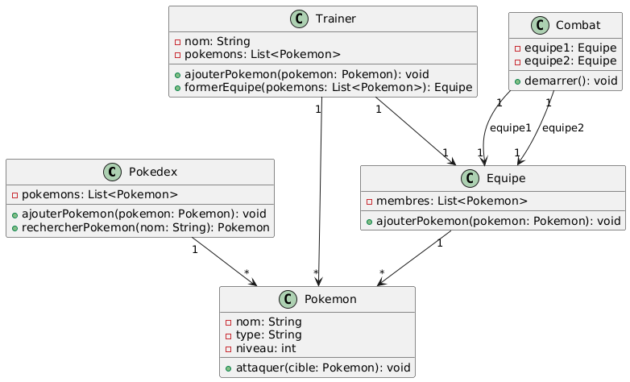

# Practical Work 2 - TCP
Dani Tiago **Faria Dos Santos**
Nicolas **Duprat**
*DAI-TIC-C*

## Pokémon Octogone édition
### Outline

- **Objective**: Create a program who uses TCP sockets in Java
- **Project Goal**: Learn how to use sockets in Java and create a protocol

## Key Features

 

- **Pokédex** Add and use any Pokémon (Yes, even Sephiroth) 
- **Teams**: Make a team from the Pokémons available
- **Trainer** :  Create your trainer
- **BATTLES !**: 1v1 a friend via Internet

## How did we split the work

 

**Dani** : Sockets, Connections, Trainer/Pokémon implementation, Menus & Docker
**Nicolas** : Battle, Refractoring & protocol design

## Pokédex

 

- Filled with Pokémons
- Loaded and saved in a .txt files

## Trainer
 
- Has a team
- Name
- Money
  

## What we used
 

- **Language**: Java
- **Tools**: Maven, Git, picoCLI & Docker

## Protocol
- The port it uses is the port number 28500.

## UML

 

## Usage
#### Docker
- Server

#### Jar
- Client

 

# Demonstration

# Questions ?

# Thank you for your attention
