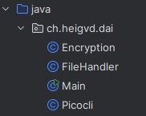

<style>
pre {
  background-color: #2e2e2e;  /* Dark background */
  color: #f8f8f2;            /* Light text color */
  font-size: 0.95em;         /* Font size */
  border-radius: 8px;        /* Rounded corners */
  padding: 12px;             /* Padding inside the code block */
  box-shadow: 0px 4px 10px rgba(0, 0, 0, 0.5); /* Shadow for depth */
  width: 100%;               /* Full width */
  margin: 0;                 /* Remove default margins */
}

pre code {
  background: none; /* Remove any background on the code element */
  display: block;
}

/* Optional: Make sure code blocks stretch to the edges */
.marp-slide {
  padding: 0 !important; /* Override default slide padding */
}
</style>

# Practical Work 2 - TCP
Dani Tiago **Faria Dos Santos**
Nicolas **Duprat**
*DAI-TIC-C*


## PicoEncrypt 1.0
### Outline

- **Objective**: Create a program who can encrypt and decrypt text and binary files with picoCLI.
- **Project Goal**: Learn how to use Java I/O and picoCLI

## Key Features

<br>

- **File mode**: Text or binary
- **Encryption** mode: Encryption = true & Decryption = False
- **Techniques**: Cesar, To Numbers, To Emoji, Xor, Mix of Cesar and Xor


## How did we split the work

<br>


**Dani** : picoCLI,  I/O, documentation
**Nicolas** : Encryption / Decryption


## GitHub

<br>


- Branchs
- Issues
- Pull Requests
  


## Structure
<br>

- Main.java
- 3 Classes
  - Encryption
  - FileHandler
  - Picocli




## What we used
<br>


- **Language**: Java
- **Tools**: Maven, Git, picoCLI


## picoCLI
<br>

```Java
import picocli.CommandLine.Option;
import picocli.CommandLine.Command;


@Command(name = "PicoEncrypt", mixinStandardHelpOptions = true, version = "PicoEncrypt 1.0", description = "Simple encrypt/decrypt app with picco")
public class Picocli implements Runnable {

    @Option(names = {"-s", "--srcFile"},
            description = "Path to the source file.\n"
                    + "Example: /path/to/myfile.txt")
    String srcFile;

    ...

    @Option(names = {"-k", "--key"},
            description = "Key for the encryption/decryption.\n"
                    + "Default : 1")
    String key;

    @Override
    public void run() {
        // Magic happens here 
    }

```
## Encryption
##### Textual files:

- Cesar encryption
- Number encryption
- Emoji encryption
  
---
  ```Java
    private String CesarEncryption(Boolean isDecrypting) {
        StringBuilder encryptedText = new StringBuilder();
        
        int shift = key.charAt(0) - 'a';
        if (shift < 0) shift = 0;

        for (int i = 0; i < text.length(); i++) {
            char c = text.charAt(i);

            // Shift all characters (including accents and symbols)
            if (isDecrypting) {
                c = (char) (c - shift);
            } else {
                c = (char) (c + shift);
            }
            encryptedText.append(c);
        }
        return encryptedText.toString();
    }
  ```
---

##### Binary files:
- Xor encryption
- Cesar encryption
- Xor + Cesar Encryption

<br>

```Java
private int BinXorEncryption(int byteData) {
    int intKey = Integer.parseInt(key);
    return byteData ^ intKey;
}
```

# Demonstration
<style scoped>
section {
  display: flex;
  justify-content: center; /* Center horizontally */
  align-items: center;     /* Center vertically */
}
</style>

# Questions ?
<style scoped>
section {
  display: flex;
  justify-content: center; /* Center horizontally */
  align-items: center;     /* Center vertically */
}
</style>

# Thank you for your attention
<style scoped>
section {
  display: flex;
  justify-content: center; /* Center horizontally */
  align-items: center;     /* Center vertically */
}
</style>