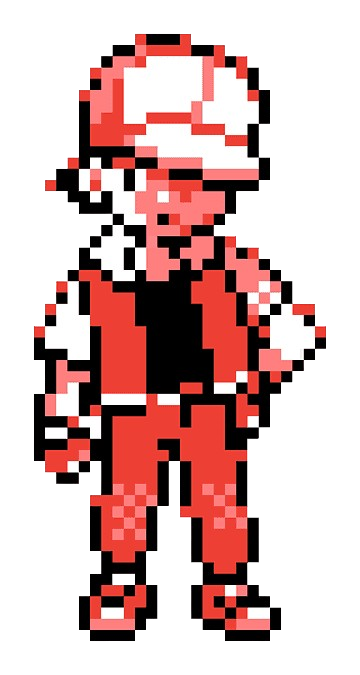
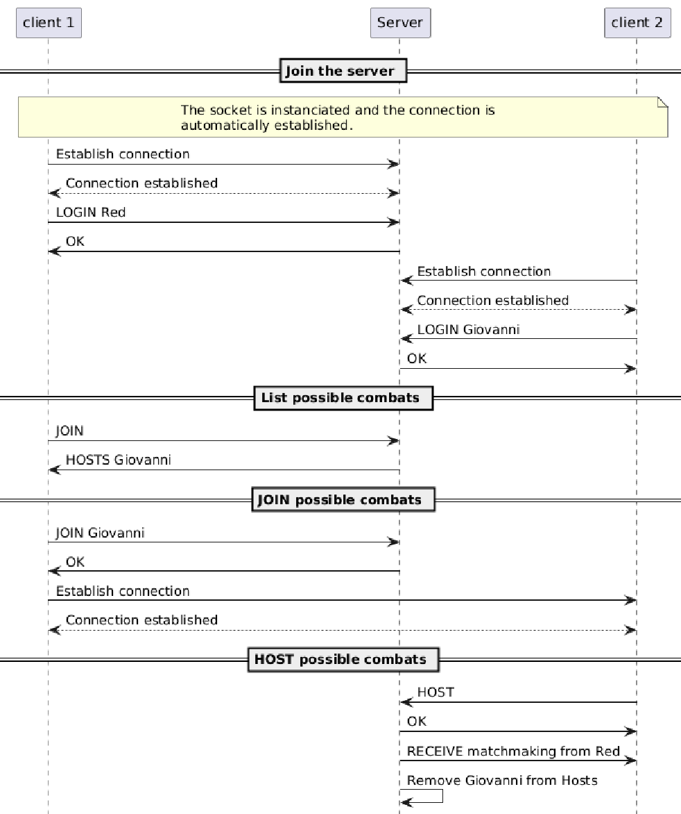

# Practical Work 2 - TCP
Dani Tiago **Faria Dos Santos**
Nicolas **Duprat**
*DAI-TIC-C*

## Pokémon Octogone édition
### Outline

- **Objective**: Create a program who uses TCP sockets in Java
- **Project Goal**: Learn how to use sockets and threads in Java and create a protocol

## How did we split the work
 

**Dani** : Sockets, Connections, Trainer/Pokémon implementation, Menus & Docker
**Nicolas** : Battle, Refractoring & protocol design

## What did we used
 

- **Language**: Java
- **Tools**: Maven, Git, picoCLI & Docker

## Key Features
 

- **Pokédex** : Add and use any Pokémon (Yes, even Sephiroth) 
- **Teams** : Make a team from the Pokémons available
- **BATTLES !** : 1v1 a friend via Internet

## Pokédex
 

- Filled with Pokémons
- Loaded and saved in a .txt files

## Trainer
 

- Has a team
- Name
- Money

## Protocol
- The port it uses is the port number 28500.

## Protocol
- Use the command **<HOST>** to create a lobby.
- Use the command **<JOIN> <hostId>** to join a lobby.

## UML

 

## Usage
#### Docker
- Server
- Client

#### Jar [Optional]
- Server
- Client

 

## Things we want to improve

- Create a custom trainer and save it
- Have a GUI
- Add sprites
- Add audio

# Demonstration

# Questions ?

# Thank you for your attention

## Acknowledgments
- **Pokémon** is a trademark of *Nintendo*, *Game Freak*, and *Creatures Inc*. All rights to images, characters, and related intellectual property are owned by their respective copyright holders.
- **Final Fantasy VII** and related characters, images, and assets are trademarks of *Square Enix*. All rights reserved.
- **UFC** (Ultimate Fighting Championship) is a registered trademark of *Zuffa, LLC*. All rights to images, videos, logos, and related intellectual property are owned by their respective copyright holders.